# DB 스키마 설계 — Zipfra

> 멀티 데이터소스(§4) 기준 ERD 및 테이블 명세. MySQL(쓰기/인증) · PostGIS(읽기/공간) · Redis(토큰)로 물리 분리.
> Cross-DB FK 미생성(논리 ID 참조만). 모든 `geom`은 `geometry(Point, 4326)` + GiST 필수.
> 개인식별정보(PII) 원본은 AES-256 암호화 저장, 일반 쿼리용으로는 마스킹 완료본을 기본 활용.

## 핵심 설계 결정

| 결정 | 내용 | 근거 |
|------|------|------|
| 물리 분리 | MySQL(쓰기/인증) ↔ PostGIS(읽기/공간) | §4 double-write 금지 및 독립 커넥션 풀 운영 |
| Cross-DB FK | 생성 안 함, ID 논리 참조만 | DB 물리 분리 및 이종 DBMS 환경 분리 |
| Same-DB FK | `reviews.user_id → users.id`, `favorites.user_id → users.id`만 실제 FK | 둘 다 MySQL 내 존재 |
| 공간 인덱스 | `geometry(Point, 4326)` + GiST + Functional Geog Index | §4 및 geography 캐스팅 시 인덱스 스킵 문제 방지 |
| PK | 단일 BIGINT AUTO_INCREMENT / BIGSERIAL | 안정성 및 표준 식별자 체계 |
| AREA 식별자 | `target_id`를 `VARCHAR(20)`로 설계. **AREA 리뷰 입도 = 법정동(동) 10자리 확정** | 법정동코드 앞자리 `0` 누락 방지 + 동 단위 차별화. (줌아웃 집계 `region_summary`는 별개로 시군구 단위 유지) |
| PII 보호 | 원본은 `encrypted_content`(AES-256, **애플리케이션 레벨**), 일반 쿼리용은 마스킹 평문 `content` | 개인정보보호법(PIPA) 준수 + DB `AES_ENCRYPT` 미사용(키 노출 방지) |
| AI 캐시 TTL | `expires_at` 컬럼 인덱싱 + Daily Event Scheduler | 24시간 TTL 만료 데이터 자동 정리 및 성능 보장 |

## Mermaid ERD

> `mysql_*` = MySQL, `pg_*` = PostGIS. 실선(`||--o{`) = 동일 DB FK. 점선(`||..o{`) = Cross-DB 논리 참조(FK 없음). Redis는 ERD 외부.

```mermaid
erDiagram
    %% ========= MySQL (primaryDataSource) =========
    mysql_users {
        bigint      id PK "AUTO_INCREMENT"
        varchar     email UK "NOT NULL"
        varchar     password_hash "NOT NULL"
        varchar     nickname
        varchar     profile_image_url "DEFAULT NULL"
        varchar     role "DEFAULT 'USER'"
        boolean     is_active "DEFAULT true"
        datetime    created_at
        datetime    updated_at
    }

    mysql_reviews {
        bigint      id PK "AUTO_INCREMENT"
        bigint      user_id FK "→ users.id"
        varchar     target_type "BUILDING | AREA"
        varchar     target_id "논리참조(PostGIS ID 또는 법정동코드)"
        text        content "마스킹 처리된 평문 리뷰 본문"
        varbinary   encrypted_content "PII 원본 AES-256 암호문(앱레벨)"
        tinyint     rating "1~5"
        datetime    created_at
        datetime    updated_at
    }

    mysql_ai_summaries {
        bigint      id PK "AUTO_INCREMENT"
        varchar     summary_type "PROPERTY_INFO | REVIEW"
        varchar     target_type "PROPERTY | BUILDING | AREA"
        varchar     target_id "논리참조(매물ID 또는 법정동코드)"
        text        summary "요약 본문(Fallback 시 null)"
        json        positives "긍정 테마 배열(nullable)"
        json        negatives "부정 테마 배열(nullable)"
        int         review_count "분석된 리뷰 수"
        varchar     model_name "예: gpt-4o-mini"
        boolean     summary_available "DEFAULT true"
        datetime    generated_at
        datetime    expires_at "TTL 24h 만료 시간"
        datetime    created_at
        datetime    updated_at
    }

    mysql_favorites {
        bigint      id PK "AUTO_INCREMENT"
        bigint      user_id FK "→ users.id"
        bigint      property_id "논리참조(PostGIS pg_real_estate_sales.id)"
        datetime    created_at
    }

    %% ========= PostGIS (spatialDataSource) =========
    pg_real_estate_sales {
        bigint      id PK "BIGSERIAL"
        varchar     building_name
        varchar     deal_type "SALE|JEONSE|WOLSE"
        varchar     property_type "APT|OFFICETEL|ROW_HOUSE"
        bigint      deal_amount "매매가(만원), 전월세 NULL"
        bigint      deposit "보증금(만원), 전월세"
        int         monthly_rent "월세(만원), 월세만/전세 0·NULL"
        numeric     exclusive_area "전용면적㎡"
        int         floor_no
        smallint    build_year "건축년도"
        char        deal_ym "거래연월 YYYYMM"
        varchar     lawd_cd "법정동코드(10)"
        varchar     jibun "지번주소"
        geometry    geom "Point, 4326 (GiST 인덱스)"
        timestamptz created_at
        timestamptz updated_at
    }

    pg_property_score {
        bigint      property_id PK "real_estate_sales.id 1:1 (PR A)"
        numeric     transit_base "§5.1 교통 base(가중치 미적용)"
        numeric     education_base "학교·학원 base"
        numeric     commerce_base "상업 base"
        numeric     convenience_base "편의 base"
        timestamptz computed_at "배치 계산 시각"
    }

    pg_poi {
        bigint      id PK "BIGSERIAL"
        varchar     name
        varchar     category "SUBWAY|BUS_STOP|SCHOOL|ACADEMY|RESTAURANT|CAFE|CINEMA|MART|CONVENIENCE_STORE|HOSPITAL|PHARMACY|BANK"
        varchar     category_group "TRANSIT | EDUCATION | COMMERCE | CONVENIENCE"
        varchar     address
        geometry    geom "Point, 4326 (GiST 인덱스)"
        timestamptz created_at
        timestamptz updated_at
    }

    pg_region_summary {
        bigint      id PK "BIGSERIAL"
        varchar     region_cd UK "시군구코드(5)"
        varchar     region_name
        geometry    geom "Point, 4326 (GiST 인덱스 추가)"
        double      center_lon
        double      center_lat
        int         deal_count
        bigint      avg_amount
        bigint      max_amount
        timestamptz created_at
        timestamptz updated_at
    }

    %% ---- 실제 FK (동일 DB: MySQL) ----
    mysql_users ||--o{ mysql_reviews : "writes"
    mysql_users ||--o{ mysql_favorites : "owns"

    %% ---- 논리 참조 (Cross-DB, FK 없음: 점선) ----
    pg_real_estate_sales ||..o{ mysql_reviews        : "target(BUILDING)"
    pg_region_summary    ||..o{ mysql_reviews        : "target(AREA)"
    pg_real_estate_sales ||..o{ mysql_ai_summaries   : "PROPERTY/BUILDING"
    pg_region_summary    ||..o{ mysql_ai_summaries   : "AREA"
    pg_real_estate_sales ||..o{ mysql_favorites      : "property"
    pg_real_estate_sales }o..o{ pg_poi               : "공간조인(ST_DWithin)"
    pg_real_estate_sales ||--|| pg_property_score    : "매물별 점수(1:1, §5.1)"

```



> Redis(`refresh_token`)는 키-값 구조: `refresh_token:{user_id}` → 토큰, `TTL = refresh 만료(예: 14d)`. 로그아웃/회전 시 키 삭제.

## 테이블 명세

### MySQL (primaryDataSource)

#### `users` — 회원

| 컬럼 | 타입 | 제약 | 설명 |
| --- | --- | --- | --- |
| `id` | BIGINT | PK, AUTO_INCREMENT | 회원 식별자 |
| `email` | VARCHAR(255) | UNIQUE, NOT NULL | 로그인 ID, JWT subject |
| `password_hash` | VARCHAR(255) | NOT NULL | BCrypt 해시(평문 금지) |
| `nickname` | VARCHAR(50) | NULL | 표시명 |
| `profile_image_url` | VARCHAR(255) | NULL | 프로필 사진 이미지 URL |
| `role` | VARCHAR(20) | NOT NULL, DEFAULT 'USER' | 권한(USER/ADMIN) |
| `is_active` | BOOLEAN | NOT NULL, DEFAULT true | 탈퇴/정지 soft 처리 |
| `created_at` | DATETIME | NOT NULL, DEFAULT CURRENT_TIMESTAMP | 생성 시각 |
| `updated_at` | DATETIME | NOT NULL, ON UPDATE CURRENT_TIMESTAMP | 수정 시각 |

인덱스: `uk_users_email(email)`.

#### `reviews` — 리뷰

| 컬럼 | 타입 | 제약 | 설명 |
| --- | --- | --- | --- |
| `id` | BIGINT | PK, AUTO_INCREMENT | 리뷰 식별자 |
| `user_id` | BIGINT | NOT NULL, FK → users.id | 작성자 (동일 DB 내 실제 FK 생성) |
| `target_type` | VARCHAR(20) | NOT NULL, CHECK IN ('BUILDING','AREA') | 대상 구분 |
| `target_id` | VARCHAR(20) | NOT NULL | BUILDING→매물 ID, **AREA→법정동코드(동, 10자리)**. 문자열 유지(leading-zero 보존) |
| `content` | TEXT | NOT NULL | 개인정보 마스킹 처리가 완료된 평문 본문 |
| `encrypted_content` | VARBINARY / BLOB | NOT NULL | PII 포함 원본의 AES-256 암호문. **애플리케이션 레벨 암호화**(키는 앱/KMS 보관, DB `AES_ENCRYPT` 미사용). base64로 보관 시 TEXT 허용 |
| `rating` | TINYINT | NULL, CHECK 1~5 | 평점 (1~5) |
| `created_at` | DATETIME | NOT NULL, DEFAULT CURRENT_TIMESTAMP | 생성 시각 |
| `updated_at` | DATETIME | NOT NULL, ON UPDATE CURRENT_TIMESTAMP | 수정 시각 |

인덱스: `idx_reviews_target_created(target_type, target_id, created_at DESC)`.

#### `ai_summaries` — AI 요약 캐시

| 컬럼 | 타입 | 제약 | 설명 |
| --- | --- | --- | --- |
| `id` | BIGINT | PK, AUTO_INCREMENT | 캐시 식별자 |
| `summary_type` | VARCHAR(20) | NOT NULL, CHECK IN ('PROPERTY_INFO','REVIEW') | 기능 구분 |
| `target_type` | VARCHAR(20) | NOT NULL, CHECK IN ('PROPERTY','BUILDING','AREA') | 대상 종류 |
| `target_id` | VARCHAR(20) | NOT NULL | 매물 식별자 ID 혹은 법정동코드 (문자열 유지) |
| `summary` | TEXT | NULL | 요약문 (Fallback 시 null) |
| `positives` | JSON | NULL | 리뷰요약 긍정 테마 배열 |
| `negatives` | JSON | NULL | 리뷰요약 부정 테마 배열 |
| `review_count` | INT | NULL | 리뷰요약 대상 건수 |
| `model_name` | VARCHAR(50) | NOT NULL | 사용된 LLM 모델명 |
| `summary_available` | BOOLEAN | NOT NULL, DEFAULT true | Fallback 플래그 |
| `generated_at` | DATETIME | NULL | 생성 시각 |
| `expires_at` | DATETIME | NOT NULL | 캐시 만료 시각 (24h TTL) |
| `created_at` | DATETIME | NOT NULL, DEFAULT CURRENT_TIMESTAMP | 생성 시각 |
| `updated_at` | DATETIME | NOT NULL, ON UPDATE CURRENT_TIMESTAMP | 수정 시각 |

인덱스: `uk_ai_summary_lookup(summary_type, target_type, target_id)`(upsert), `idx_ai_expires_at(expires_at)`.

#### `favorites` — 즐겨찾기

| 컬럼 | 타입 | 제약 | 설명 |
| --- | --- | --- | --- |
| `id` | BIGINT | PK, AUTO_INCREMENT | 즐겨찾기 식별자 |
| `user_id` | BIGINT | NOT NULL, FK → users.id | 회원 식별자 (동일 DB 내 실제 FK 생성) |
| `property_id` | BIGINT | NOT NULL | 매물 식별자 (PostGIS pg_real_estate_sales.id 논리 참조) |
| `created_at` | DATETIME | NOT NULL, DEFAULT CURRENT_TIMESTAMP | 생성 시각 |

인덱스: `uk_favorites_user_property(user_id, property_id)`(중복 즐겨찾기 방지 및 사용자별 조회 가속화).

---

### PostGIS (spatialDataSource)

#### `real_estate_sales` — 실거래가
| 컬럼 | 타입 | 제약 | 설명 |
|------|------|------|------|
| `id` | BIGINT | PK (IDENTITY) | 매물 식별자 |
| `building_name` | VARCHAR(200) | NULL | 건물명 |
| `deal_type` | VARCHAR(10) | NOT NULL | 거래유형 `SALE`\|`JEONSE`\|`WOLSE` (PR A 신설) |
| `property_type` | VARCHAR(20) | NOT NULL | 매물유형 `APT`\|`OFFICETEL`\|`ROW_HOUSE`(빌라) — 3종, 원룸 제외 (PR A 신설) |
| `deal_amount` | BIGINT | NULL | 매매가(만원). **전월세는 NULL** (기존 NOT NULL → 완화) |
| `deposit` | BIGINT | NULL | 보증금(만원). 전월세(`JEONSE`/`WOLSE`)일 때 (PR A 신설) |
| `monthly_rent` | INTEGER | NULL | 월세(만원). `WOLSE`만, `JEONSE`는 0/NULL (PR A 신설) |
| `exclusive_area` | NUMERIC(7,2) | NOT NULL | 전용면적 (㎡) |
| `floor_no` | INTEGER | NULL | 층 |
| `build_year` | SMALLINT | NULL | 건축년도 (PR A 신설) |
| `deal_ym` | CHAR(6) | NOT NULL | 거래연월 'YYYYMM' |
| `lawd_cd` | VARCHAR(10) | NOT NULL | 법정동코드 |
| `jibun` | VARCHAR(200) | NULL | 지번 주소 |
| `geom` | geometry(Point, 4326) | NOT NULL | 좌표 (WGS84, 공간 인덱싱) |
| `created_at` | TIMESTAMPTZ | NOT NULL, DEFAULT now() | 적재 시각 |
| `updated_at` | TIMESTAMPTZ | NOT NULL, DEFAULT now() | 갱신 시각 |

> ⚠️ **가격 컬럼 분리 이유(국토부 공공데이터 정합)**: 매매는 `거래금액`, 전월세는 `보증금`+`월세금액`으로 데이터셋이 분리돼 단일 `deal_amount`로 표현 불가. MAP-01 가격 필터는 `deal_type`별 대상 컬럼 분기(§8.1.1).

인덱스: `gist_res_geom` GiST(geom), `gist_res_geog` GiST((geom::geography)) (함수형 공간 인덱스), `idx_res_lawd_ym(lawd_cd, deal_ym)`, `idx_res_filter(deal_type, property_type)` (MAP-01 검색 필터, PR A 신설).

#### `property_score` — 매물별 점수 사전계산 (PR A, §5.1)
| 컬럼 | 타입 | 제약 | 설명 |
|------|------|------|------|
| `property_id` | BIGINT | PK | `real_estate_sales.id` 1:1 논리참조 |
| `transit_base` | NUMERIC(7,4) | NOT NULL DEFAULT 0 | 교통 그룹 base(가중치 미적용) |
| `education_base` | NUMERIC(7,4) | NOT NULL DEFAULT 0 | 학교·학원 그룹 base |
| `commerce_base` | NUMERIC(7,4) | NOT NULL DEFAULT 0 | 상업 그룹 base |
| `convenience_base` | NUMERIC(7,4) | NOT NULL DEFAULT 0 | 편의 그룹 base |
| `computed_at` | TIMESTAMPTZ | NOT NULL DEFAULT now() | 배치 계산 시각 |

> base 는 §5 감쇠합산(가중치 미적용). 기동 시 배치(ApplicationRunner)가 `LocationScoreCalculator` 로 산출·upsert. 0~100 정규화는 프론트 표시 단계(§5.1).

#### `poi` — 상권/인프라
| 컬럼 | 타입 | 제약 | 설명 |
|------|------|------|------|
| `id` | BIGINT | PK (IDENTITY) | POI 식별자 |
| `name` | VARCHAR(200) | NOT NULL | 상호/시설명 |
| `category` | VARCHAR(30) | NOT NULL | 세부 분류 (SUBWAY/BUS_STOP/SCHOOL/ACADEMY/RESTAURANT/CAFE/CINEMA/MART/CONVENIENCE_STORE/HOSPITAL/PHARMACY/BANK) |
| `category_group` | VARCHAR(20) | NOT NULL | TRANSIT / EDUCATION / COMMERCE / CONVENIENCE (§5 4분류, ENV 폐기) |
| `address` | VARCHAR(255) | NULL | 주소 |
| `geom` | geometry(Point, 4326) | NOT NULL | 좌표 (WGS84, 공간 인덱싱) |
| `created_at` | TIMESTAMPTZ | NOT NULL, DEFAULT now() | 적재 시각 |
| `updated_at` | TIMESTAMPTZ | NOT NULL, DEFAULT now() | 갱신 시각 |

인덱스: `gist_poi_geom` GiST(geom), `gist_poi_geog` GiST((geom::geography)), `idx_poi_category(category)`.

#### `region_summary` — 사전 집계 요약 (줌아웃 ≤ 14)
| 컬럼 | 타입 | 제약 | 설명 |
|------|------|------|------|
| `id` | BIGINT | PK (IDENTITY) | 식별자 |
| `region_cd` | VARCHAR(5) | UNIQUE, NOT NULL | 시군구코드(줌아웃 집계 단위, 동 단위 reviews와 별개) |
| `region_name` | VARCHAR(100) | NOT NULL | 지역명 |
| `geom` | geometry(Point, 4326) | NOT NULL | 지역 중심 공간 컬럼 (GiST 인덱싱) |
| `center_lon` | DOUBLE PRECISION | NOT NULL | 중심 경도 |
| `center_lat` | DOUBLE PRECISION | NOT NULL | 중심 위도 |
| `deal_count` | INTEGER | NOT NULL, DEFAULT 0 | 거래 건수 |
| `avg_amount` | BIGINT | NULL | 평균 거래금액 (만원) |
| `max_amount` | BIGINT | NULL | 최고 거래금액 (만원) |
| `created_at` | TIMESTAMPTZ | NOT NULL, DEFAULT now() | 생성 시각 |
| `updated_at` | TIMESTAMPTZ | NOT NULL, DEFAULT now() | 갱신 시각 (배치 갱신) |

인덱스: `uk_region_cd(region_cd)`, `gist_region_geom` GiST(geom).

> ⚠️ **`geom` ↔ `center_lon/center_lat` 중복 주의**: 둘은 같은 좌표를 이중 보관(프론트가 `ST_X/ST_Y` 없이 직접 읽기 위함). 드리프트 방지를 위해 **심야 배치에서 `geom`을 단일 진실 원천**으로 두고 `center_lon = ST_X(geom)`, `center_lat = ST_Y(geom)`로 항상 파생 생성한다. 둘을 독립적으로 입력하지 말 것.
> ℹ️ 시군구는 전국 ~250행 규모라 `gist_region_geom`의 이득은 작다(풀스캔도 충분히 빠름). bbox 필터 일관성을 위해 유지하되 성능 핵심 인덱스는 아니다.

---

## 핵심 인덱스 설계 & DDL 스크립트

### 1) PostGIS (spatialDataSource) 공간 인덱스 DDL
```sql
-- 실거래가 공간 검색 및 geography 캐스팅 대비용 인덱스
CREATE INDEX gist_res_geom ON real_estate_sales USING GIST (geom);
CREATE INDEX gist_res_geog ON real_estate_sales USING GIST ((geom::geography));

-- POI 반경 미터 조회용 인덱스
CREATE INDEX gist_poi_geom ON poi USING GIST (geom);
CREATE INDEX gist_poi_geog ON poi USING GIST ((geom::geography));

-- region_summary BBox 줌아웃 요약 조회용 공간 인덱스 추가
CREATE INDEX gist_region_geom ON region_summary USING GIST (geom);

-- 기타 조인 및 필터 성능 최적화용 일반 인덱스
CREATE INDEX idx_res_lawd_ym ON real_estate_sales (lawd_cd, deal_ym);
CREATE INDEX idx_res_filter ON real_estate_sales (deal_type, property_type);  -- MAP-01 검색 필터 (PR A)
CREATE INDEX idx_poi_category ON poi (category);
```

> ⚠️ **인덱스식 = 쿼리식 정확 일치 필수**: `gist_*_geog`(함수형 인덱스)를 타려면 매퍼 SQL의 표현식이 인덱스 정의와 **문자 그대로 동일**해야 한다.
> - ✅ `ST_DWithin(geom::geography, :pt::geography, :meters)` — 인덱스 사용
> - ❌ `ST_DWithin(geom::geography(Point,4326), ...)` — typmod 차이로 인덱스 스킵(풀스캔)
> MyBatis Native SQL에 위 형식을 고정하고 주석으로 명시한다. 반경 단위는 **미터**(geography), bbox/줌 렌더는 `geom && ST_MakeEnvelope(...,4326)`로 **geometry** 인덱스를 사용한다.
>
> ⚠️ **이중 GiST 쓰기 비용**: 공간 테이블마다 geometry+geography GiST 2개라 심야 대량 적재 시 인덱스 유지비가 2배. **배치 절차(§9)에서 적재 전 `DROP INDEX` → COPY/UPSERT → `CREATE INDEX`** 순으로 재구성해 적재 처리량을 확보한다.

### 2) MySQL (primaryDataSource) 성능 및 인증 인덱스 DDL
```sql
-- 로그인 이메일 고속 조회
CREATE UNIQUE INDEX uk_users_email ON users (email);

-- target별 최신순 리뷰 목록 조회 최적화
CREATE INDEX idx_reviews_target_created ON reviews (target_type, target_id, created_at DESC);

-- AI 요약 캐시 Upsert 성능 고속화 및 캐시 조회 인덱스
CREATE UNIQUE INDEX uk_ai_summary_lookup ON ai_summaries (summary_type, target_type, target_id);

-- 만료된 캐시 정리를 위한 만료 시각 인덱스
CREATE INDEX idx_ai_expires_at ON ai_summaries (expires_at);
```

### 3) AI 캐시 자동 Cleanup 스케줄러 DDL (MySQL)
```sql
-- 매일 새벽 3시에 24시간이 경과하여 만료(expires_at < NOW)된 캐시를 자동 삭제하는 스케줄러 구성
SET GLOBAL event_scheduler = ON;

CREATE EVENT IF NOT EXISTS event_cleanup_expired_ai_summaries
ON SCHEDULE EVERY 1 DAY
STARTS TIMESTAMP(CURRENT_DATE, '03:00:00')
DO
  DELETE FROM ai_summaries 
  WHERE expires_at < NOW();
```